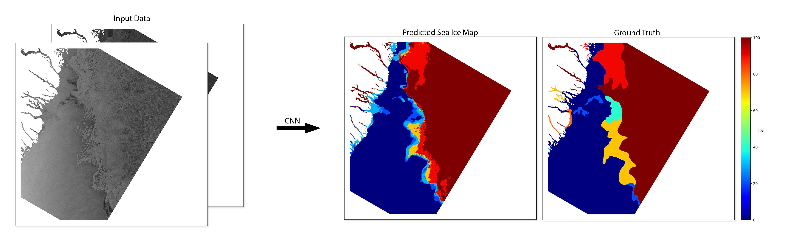

# ASIP / AI4Arctic: Automated Sea Ice Mapping




#### Dependencies:
Below are the dependencies required in order to run *run_model.py* as well as the tested versions of each library.  
* NumPy (v1.19.2)
* netCDF4 (v1.5.5.1)
* PyTorch (v1.4.0)
* OpenCV (v4.5.0)
* GDAL (v3.2.1)

#### *run_model.py*:

The *run_model.py* script allows the user to run a pre-trained CNN model on a Sentinel-1 SAR scene and a co-registered AMSR2 scene, which have undergone the preprocessing steps described in the ASIP / AI4Arctic Sea Ice Dataset v2 manual (dataset and manual can be found [here](https://data.dtu.dk/articles/dataset/AI4Arctic_ASIP_Sea_Ice_Dataset_-_version_2/13011134)), to produce a sea ice map.

###### *run_model.py* usage:
```
$ python run_model.py --model=/path/to/pretrained_model.pt --input=/path/to/input_data.nc --output=/path/to/output/dir --device=cuda
``` 
